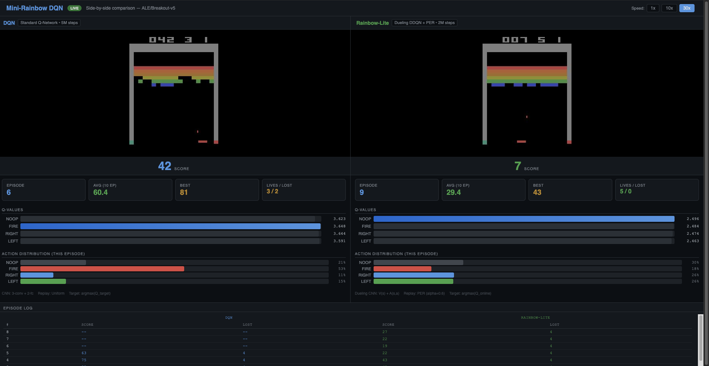
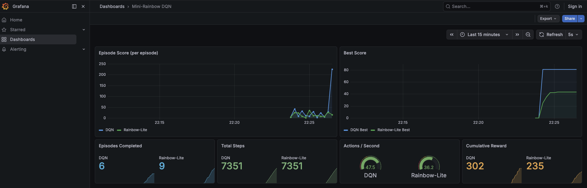

# Mini-Rainbow DQN

**End-to-end deep reinforcement learning platform for Atari Breakout with side-by-side agent comparison, live inference, and observability**

[](https://www.python.org/downloads/release/python-3110/)
[](https://opensource.org/licenses/MIT)
[](https://hub.docker.com/u/sherozshaikh)

---

## What This Does

Trains deep Q-learning agents to play Atari Breakout and provides a live platform to watch them compete side-by-side. The system implements four DQN variants with increasing sophistication:

- **DQN** -- baseline Deep Q-Network (Mnih et al., 2015)
- **Double DQN** -- reduces Q-value overestimation (van Hasselt et al., 2016)
- **Dueling DQN** -- separates value and advantage streams (Wang et al., 2016)
- **Rainbow-Lite** -- combines Double DQN + Dueling + Prioritized Experience Replay

The live platform runs two trained agents simultaneously, streaming game frames and metrics to a browser dashboard with real-time Q-value visualization, action distribution, and episode history.

---

## Architecture

```
                    +--------------------+
                    |   Platform UI      |
                    |  (localhost:8000)   |
                    +--------+-----------+
                             |
                    +--------v-----------+
                    |     FastAPI         |
                    |  /stream /metrics   |
                    |  /health /act       |
                    +--+-----+-------+---+
                       |     |       |
            +----------+  +--+--+  +-+----------+
            |             |     |               |
    +-------v---+  +------v-+  +v---------+  +-v-----------+
    | DQN Agent |  |Rainbow |  | Prom.    |  | Grafana     |
    | (QNetwork)|  | -Lite  |  | Metrics  |  | Dashboards  |
    +-----------+  |(Dueling)|  +---------+  +-------------+
                   +--------+

    Training Pipeline (Hydra + W&B):
    Config -> Environment -> Agent -> Train Loop -> Evaluate -> Checkpoint
```

## Tech Stack

| Layer | Technology |
|-------|-----------|
| Deep Learning | PyTorch (CNN Q-Networks) |
| RL Environment | Gymnasium + ALE (Atari Learning Environment) |
| Config | Hydra (composable YAML configs) |
| Experiment Tracking | Weights & Biases |
| API | FastAPI, Uvicorn |
| Monitoring | Prometheus (metrics collection) + Grafana (dashboards) |
| Deployment | Docker, Docker Compose, GCP/AWS free-tier VM |

---

## Quick Start

```bash
git clone https://github.com/sherozshaikh/mini-rainbow-dqn.git
cd mini-rainbow-dqn
```

### Option A: Docker (recommended)

Start Docker (Docker Desktop, or Colima on macOS: `colima start --memory 4 --cpu 2`).

```bash
make up
```

Open http://localhost:8000 -- two trained agents play Breakout side-by-side with live metrics.

### Option B: Docker (standalone, no Prometheus/Grafana)

```bash
make docker-build
docker run --rm -p 8000:8000 sherozshaikh/mini-rainbow-dqn:v1.0.0
```

Open http://localhost:8000.

---

## Service Dashboard

When running with `make up`, all services are available:

| URL | Service |
|-----|---------|
| http://localhost:8000 | Platform Dashboard |
| http://localhost:8000/docs | Swagger API Docs |
| http://localhost:8000/metrics | Prometheus Metrics |
| http://localhost:8000/health | Health Check |
| http://localhost:9090 | Prometheus |
| http://localhost:3000 | Grafana (admin / admin) |

---

## Training Results

### Stage 1: Baseline DQN (5M steps, 21 hours on NVIDIA RTX A6000)

| Metric | Value |
|--------|-------|
| Peak Eval Reward | 47.8 (step 2.4M) |
| Final Eval Reward | 20.0 |
| Training FPS | 67-75 |
| Checkpoint Size | 26 MB |

**Eval reward progression:**

| Steps | Eval Reward | Epsilon |
|-------|------------|---------|
| 100K | 0.3 | 0.90 |
| 500K | 18.1 | 0.50 |
| 1M | 19.8 | 0.01 |
| 1.5M | 35.0 | 0.01 |
| 2.4M | **47.8** | 0.01 |
| 5M | 20.0 | 0.01 |

### Stage 2: Rainbow-Lite (2M steps, 9.5 hours on NVIDIA RTX A6000)

Double DQN + Dueling Networks + Prioritized Experience Replay.

| Metric | Value |
|--------|-------|
| Peak Eval Reward | 18.4 (step 1.7M) |
| Final Eval Reward | 17.0 |
| Training FPS | 61 |
| Checkpoint Size | 51 MB |

**Note:** Rainbow-Lite was trained for 2M steps (vs 5M for DQN) as a comparison run. The architectural improvements (Double DQN, Dueling, PER) typically surpass baseline DQN given equivalent training time, consistent with published results from DeepMind.

### W&B Experiment Tracking

Training metrics (loss, reward, epsilon, Q-values) were tracked via Weights & Biases across all runs.

---

## Prometheus Queries

Useful queries for the Prometheus UI at http://localhost:9090:

| Query | Description |
|-------|-------------|
| `dqn_current_score` | Current score for each agent |
| `dqn_best_score` | All-time best score per agent |
| `dqn_avg_score_10` | Rolling average (last 10 episodes) |
| `dqn_episodes_total` | Total episodes completed per agent |
| `dqn_steps_total` | Total environment steps per agent |
| `dqn_actions_per_second` | Agent throughput |
| `dqn_total_reward` | Cumulative reward across all episodes |
| `rate(dqn_episodes_total[5m])` | Episodes completed per second |
| `dqn_best_score{agent="DQN"} - dqn_best_score{agent="Rainbow-Lite"}` | Score difference between agents |

---

## API Endpoints

| Method | Endpoint | Description |
|--------|----------|-------------|
| GET | `/` | Platform dashboard (live agent comparison) |
| GET | `/stream` | SSE stream of game frames + metrics |
| GET | `/health` | Health check (model load status, episode counts) |
| GET | `/metrics` | Prometheus-compatible metrics |
| POST | `/speed/{multiplier}` | Set game speed (1x, 10x, 30x) |

---

## Training (reproduce from scratch)

### VM Setup

```bash
uv venv .venv_mini_rainbow --python 3.11
source .venv_mini_rainbow/bin/activate
make install
make install-torch-cu126    # match your CUDA version
```

### Train

```bash
make train-stage1           # DQN baseline, 5M steps
make train-stage2           # Rainbow-Lite, 2M steps
```

### Validate all variants before full training

```bash
make validate-all           # runs all 4 variants for 2000 steps each
```

---

## Deploy to Cloud (Free Tier)

The Docker image includes pre-trained models. Deploy in under 5 minutes:

```bash
# On any Ubuntu 22.04 VM (GCP e2-micro or AWS t2.micro):
sudo apt-get update && sudo apt-get install -y docker.io
sudo fallocate -l 1G /swapfile && sudo chmod 600 /swapfile && sudo mkswap /swapfile && sudo swapon /swapfile
sudo docker pull sherozshaikh/mini-rainbow-dqn:v1.0.0
sudo docker run -d --name mini-rainbow --restart unless-stopped -p 8000:8000 sherozshaikh/mini-rainbow-dqn:v1.0.0
```

Open `http://<VM_EXTERNAL_IP>:8000` (ensure port 8000 is open in the firewall).

Full step-by-step guides:
- **GCP**: [docs/DEPLOY_GCP.md](docs/DEPLOY_GCP.md) (e2-micro, free tier)
- **AWS**: [docs/DEPLOY_AWS.md](docs/DEPLOY_AWS.md) (t2.micro, free tier)

---

## Project Structure

```
mini-rainbow-dqn/
├── mini_rainbow/
│   ├── configs/
│   │   ├── config.yaml                # Global config (Hydra)
│   │   ├── env/breakout.yaml          # Environment settings
│   │   ├── agent/                     # Agent configs (dqn, double_dqn, dueling_ddqn, rainbow_lite)
│   │   ├── training/                  # Training loop configs (default, stage2)
│   │   ├── replay/                    # Replay buffer configs (uniform, prioritized)
│   │   └── experiment/                # Experiment presets (stage1_dqn, stage2_rainbow_lite)
│   │
│   ├── src/
│   │   ├── envs/atari_env.py          # Atari environment factory with DQN preprocessing
│   │   ├── networks/
│   │   │   ├── q_network.py           # Standard CNN Q-Network (Nature DQN)
│   │   │   └── dueling_q_network.py   # Dueling Q-Network (V + A streams)
│   │   ├── replay/
│   │   │   ├── base.py                # Abstract replay buffer interface
│   │   │   ├── uniform.py             # Uniform random sampling buffer
│   │   │   └── prioritized.py         # Prioritized experience replay (sum-tree)
│   │   ├── agents/dqn_agent.py        # Unified DQN agent (standard, double, dueling, PER)
│   │   ├── training/trainer.py        # Training loop orchestrator
│   │   ├── evaluation/evaluator.py    # Deterministic evaluation with video recording
│   │   ├── logging/wandb_logger.py    # W&B logging with graceful fallback
│   │   ├── platform/
│   │   │   ├── app.py                 # FastAPI live platform (side-by-side agents)
│   │   │   └── page.py               # Self-contained HTML dashboard
│   │   ├── api/app.py                 # FastAPI inference endpoint (/act)
│   │   └── utils/
│   │       ├── seed.py                # Reproducibility utilities
│   │       └── checkpoint.py          # Save/load checkpoint utilities
│   │
│   ├── scripts/
│   │   ├── train.py                   # Training entry point (Hydra)
│   │   ├── evaluate.py                # Standalone evaluation
│   │   ├── serve.py                   # Inference API server
│   │   └── platform.py               # Live platform server
│   │
│   └── docker/
│       ├── Dockerfile                 # Platform image (baked checkpoints)
│       ├── Dockerfile.api             # Lightweight inference-only image
│       ├── prometheus/                # Prometheus scrape config
│       └── grafana/                   # Grafana datasource + dashboard provisioning
│
├── docs/
│   ├── screenshots/                   # Platform UI and Grafana screenshots
│   ├── DEPLOY_GCP.md                  # GCP free-tier deployment guide
│   └── DEPLOY_AWS.md                  # AWS free-tier deployment guide
│
├── docker-compose.yml                 # Full stack (platform + Prometheus + Grafana)
├── pyproject.toml                     # Dependencies and project metadata
├── Makefile                           # Development and deployment commands
└── RUNBOOK.md                         # Operational guide
```

---

## Makefile Targets

```
make setup                Create venv with uv
make install              Install core deps (skinny)
make install-all          Install all extras + dev tools
make install-torch-cu126  Install PyTorch for CUDA 12.6+ (A6000)

make train-stage1         Stage 1: Baseline DQN (5M steps)
make train-stage2         Stage 2: Rainbow-Lite (2M steps)
make train ARGS='...'     Train with custom Hydra overrides
make smoke-test           Quick 1000-step sanity check
make validate-all         Validate all 4 variants (~5 min)

make eval CKPT=path       Evaluate a checkpoint
make run                  Run platform locally (port 8000)
make up                   Start full stack (platform + Prometheus + Grafana)
make down                 Stop all services
make ps                   Show running containers

make docker-build         Build platform image
make docker-run           Run platform container
make docker-push          Push image to Docker Hub

make lint                 Lint with ruff
make format               Format with isort + black + ruff
make clean                Remove generated files
```

---

## Screenshots

### Platform -- DQN vs Rainbow-Lite Side-by-Side


### Grafana -- Monitoring Dashboard


---

## Training Artifacts

Pre-trained checkpoints and evaluation videos are available on [Google Drive](https://drive.google.com/drive/folders/1Bsm8KF7A4NYIuT2QxDj5uFK3pK3eeWg-?usp=sharing):

```
Mini-Rainbow-DQN/
├── videos/
│   ├── stage1_dqn/
│   │   ├── step_100K_random.mp4          (agent is random, score ~0)
│   │   ├── step_1.5M_learning.mp4        (agent starts breaking bricks)
│   │   └── step_2.4M_peak.mp4            (best performance, score ~48)
│   └── stage2_rainbow_lite/
│       ├── step_100K_random.mp4
│       ├── step_1M_learning.mp4
│       └── step_1.7M_peak.mp4
├── checkpoints/
│   ├── stage1_dqn_best.pt                (best DQN checkpoint, 26 MB)
│   └── stage2_rainbow_lite_best.pt       (best Rainbow-Lite checkpoint, 51 MB)
└── README.txt
```

---

## License

MIT License - see [LICENSE](LICENSE) file for details.

---

## Author

**Sheroz Shaikh** - [Portfolio](https://sherozshaikh.github.io/) | [GitHub](https://github.com/sherozshaikh) | [LinkedIn](https://www.linkedin.com/in/sherozshaikh/)
